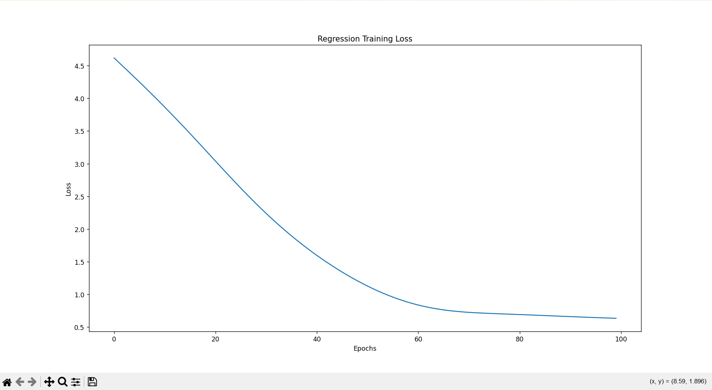
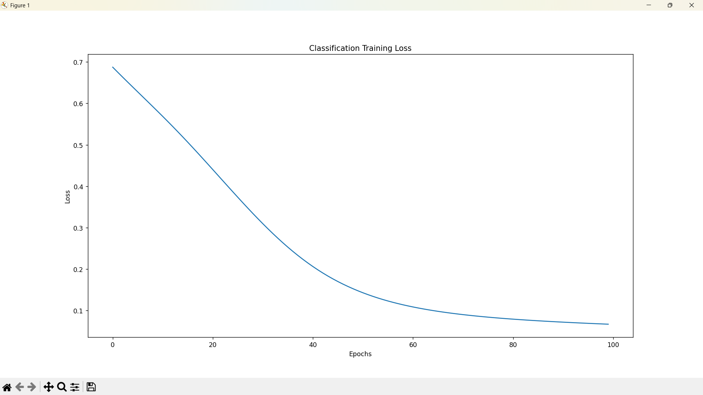

# Neural Network Assignment (PyTorch)

## 📌 Overview
This project implements Artificial Neural Networks (ANN) using PyTorch for two tasks:
- Regression
- Classification

The objective is to understand model training, evaluation, and the impact of hyperparameters.

---

##  Datasets

### 1. Regression
- Dataset: California Housing Dataset
- Task: Predict house prices based on input features

### 2. Classification
- Dataset: Breast Cancer Wisconsin Dataset
- Task: Classify tumors as malignant or benign

---

##  Preprocessing Steps
- Feature scaling using StandardScaler
- Train-Test Split (80% training, 20% testing)
- Conversion to PyTorch tensors

---

##  Model Architecture
Both models use a simple Artificial Neural Network:

- Input Layer
- Hidden Layer 1 → 64 neurons (ReLU)
- Hidden Layer 2 → 32 neurons (ReLU)
- Output Layer
  - Regression → 1 neuron
  - Classification → 1 neuron (Sigmoid applied during evaluation)

---

##  Training Details

| Task           | Loss Function        | Optimizer |
|----------------|--------------------|----------|
| Regression     | MSELoss             | Adam     |
| Classification | BCEWithLogitsLoss   | Adam     |

---

##  Hyperparameter Experiment

Learning Rate Comparison:

| Learning Rate | Regression Loss | Classification Accuracy |
|--------------|----------------|-------------------------|
| 0.01         | Lower (~0.39)  | ~93%                    |
| 0.001        | Higher (~0.60) | ~96%                    |

---

##  Results

### Regression Output
- Model successfully reduced loss over epochs
- Final test loss demonstrates learning capability

### Classification Output
- Achieved high accuracy (~96%)
- Model effectively distinguishes between classes

---

##  Graphs

### Regression Training Loss

### Classification Training Loss

---

##  Conclusion
- Lower learning rate improves stability but slows convergence
- ANN models perform well for both regression and classification tasks
- Proper preprocessing significantly improves results

---

